## UXD Tappy Toes - Design Development
Submitted: 10/17/19

To pick off from where we left off in our Needs Analysis Phase, we continued to work to work on well-rounded personas that would allow us to better understand our users. We created the following personas to represent the space of the small business owners:

To pick off from where we left off in our Needs Analysis Phase, we continued to work to work on well-rounded personas that would allow us to better understand our users. We created the following personas to represent the space of the small business owners:

* Got it Together Jessica: Owner/manager of a custom gift shop, with ~7 employes to manage. She has been in the industry for many years and has a good, working system going that she will only change if it provides enough benefits.

* Online Olivia: Owner of a craft business, she does mostly everything herself. She quickly adapts to changing retail conditions and uses many different platforms to reach customers.

* Busy Brian: Owner/manager of a restaurant. He has 3 shift managers and 6 other employees to manage. Doesn’t have much time to devote to answering questions/managing social media platforms.

* Not So Savvy Nancy: Owner of a local flower shop. Most of her business so far has relied on in-person communication. Thinks social media is scary/hard to approach, but sees its potential and would like to use it. 

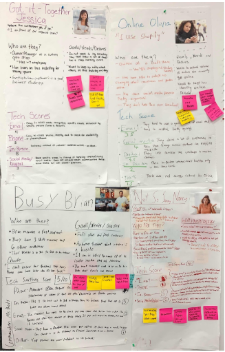

#### Interaction Flow/Storyboard

After categorizing the needs and goals of our users into these personas, we then proceeded to use this information to understand some of the design requirements that each persona would impose on our design. We then categorized those design requirements, looking for similarities in requirements that would better inform the implementation we should continue with.

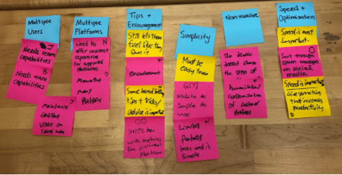

With these in mind, we decided to flesh out three approaches that met different intersections of needs for our personas. The first was the most similar to our original idea, a platform that consolidates most all of the user’s communications onto one platform. The second approach was that of a product management system that allows the business owner to easily access their product/service information to share with customers. The third approach is a social media posting platform that will help maintain pages across multiple platforms, as well as guide with posting.

Because we took a bit more time to better understand our users and their needs, we have not gotten as far with selecting a design approach to continue with and tested with our users. With the time restriction we are working in, we decided to further flesh out the three preliminary ideas that we came up with and perform a less thorough version of the user testing process with each of these, in order to both practice the design development skills and further develop these ideas in order to choose the best one to continue with.

#### Design Ideas

Cross Platform Message Consolidation

This design implementation focuses on the fact that many business owners receive multiple messages across various platforms, and that the most common way to respond to these messages is to check each platform individually. 

This implementation for a message consolidation platform is designed with the needs and wants of Jessica and Olivia more so than our other two personas. This was designed to be a phone app because these two personas have easy access to their phone while at work and are constantly alert for incoming notifications.

After sketching out this idea, we created a small flow diagram for how this platform would work for these target two personas, and a paper prototype for initial tests.

The flowcharts currently are a great simplification for how these personas would interact with this platform, but served as an initial basis to start to think about how to design the app. Jessica manages a larger team, and needs for any new service she uses to be team compatible and easy to learn, where there is a consistent business voice. Olivia deals with large volumes of communication with similar questions, and would benefit from a way to consolidate these multiple platforms into one place, and from using templates to quickly fire off answers to frequently asked questions.

From performing limited user testing with Oliners, the area that seemed to need the most further attention and development was the template implementation. The concern was that with the current implementation, the business managers may come off as robotic/reading off script, or the auto filled fields will be too small to contain the full template information. Two possible approaches to help remedy these is to auto generate multiple openings/greetings, or to have only the information itself be available as a template, and have the person sending the message type out the surrounding context. 
 
### Search Feature

The search feature allows customers to search a database for products, customers, FAQ’s and Events in order to answer customer questions more efficiently. The simple search flow optimizes for speed and brevity so that our users don’t have to take too much time away from the customers in order to find out the information that they need.

To use the search feature, the user types into the search bar and suggested search items are presented below.

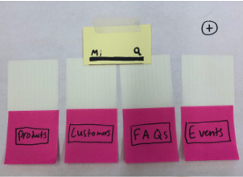

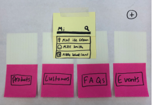

They also appear below the categories as cards with a smaller amount of information that can fit onto this view.

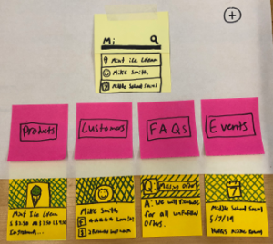

The user can also filter the cards by the different category types of information.

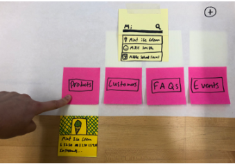

If the user clicks on one of the cards then a pop-up box appears with all of the information about said card.

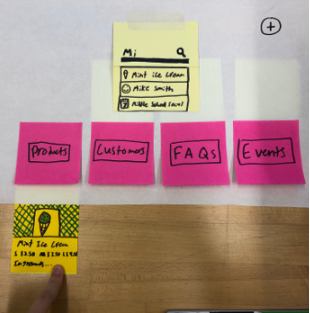

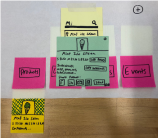

This feature would be useful for Busy Brian as they have a lot of in person and on the phone communications. It would also be useful for Nancy and Jessica to create more personal experiences for their customers as they could spend less time looking at the computer. The design falls a bit short for Online Olivia as she doesn’t have as much of a need for a platform for using during in-person interactions. It can however, still be helpful to her if she has a lot of products to manage or would like to see a profile for a specific customer, but the design is more optimized for in-person interactions than for digital communications.

At first I considered having a file system to save the different templates and ingredients lists because that is what our customers tended to use. While this design is the norm, it also causes frustrations as a file system is difficult to quickly search and identity information. A card system is much more efficient for quickly discovering small snippets of information.

One key insight that I gained was to always check back with your personas and their needs throughout the entire mockup creation process. It is too easy to subconsciously forget about who you are designing for and fall into common design patterns of other apps that work well. With each decision, really understand which person would benefit from each feature and don’t just add features blindly that might not be useful to anyone specifically. This just creates a more cluttered interface that is more difficult to use as the information is harder to find.

### Outward Facing Communication Application (OFCA)

What is your design?

This design focuses on allowing users to perform outward facing communication in an organized way, allowing quick posting with minimal experience, and a consistent online presence.  This design is meant for Nancy.

How does it work? [This is both justification and documentation.]

The design is a computer application that helps you draft a generalized post that then can be sent to multiple platforms.  The generalized post, on top of the main body of the post can have various information types, including but not limited to pictures, location, and links.  These are populated in the posts to be made on each site if the site supports the given information type.  (some platforms may not support pictures or location for example).  Once all of the information desired is submitted, the user is prompted to check the appearance of each of the posts being made.  This allows them to see a preview of each post and make edits / determine if some sites won’t be able to handle the post (ex. Twitter has a character limit, thus this sites post would need to be specifically edited to fit this requirement).

#### WalkThrough:

Below is what the posting screen looks like without any attachments.  The user can click final check to go on to reviewing the posts and finalizing the post.

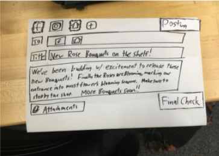

The artifact below is what appears once the attachment button is pressed, this gives options to further customize and personalize the posts.

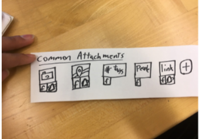

Below is what the screen looks like after adding some attachments (in particular Image and Location).

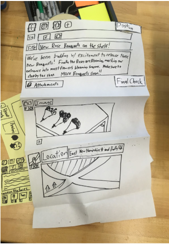

This design meets the user’s needs to some extent, which is to say it could be better and needs improvement.  The user needs something easy and fast to use that can encourage and help them to post in a consistent and organized way.  Additionally, the user needs to be able to post fast during work hours, and slowly / with more consideration when they are more free.

In the end this design got at the core need of being able to post in a consistent and organized way, however there needs to be more consideration for the different modes through which the user will interact with the application and how to incorporate those modes in a seamless fashion.  I think this can be achieved in some ways be removing clutter from the posting screen somehow without reducing visibility and removing the beginning screen and going straight to the post screen.

In an earlier iteration of this design the user was presented with every feature that the posting screen had to offer.  This wasn’t approaching the need of simplicity and potentially speed of the user because they are presented with a lot of optional information that clutters the space and simply detracts from the experience if they don’t plan on using them. 

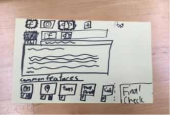

Instead I chose to replace that with a small “attachments” button.  This allows them to still interact and explore that feature given time, but altogether ignore it if they are in a hurry.
Some key insights from this design is that while the functionalities we want are easy to summarize, when going into detail about how to actually design it, there is a very fine tradeoff between the capabilities of the application and the simplicity.  Organization and smart design can greatly help with achieving more of both of these ideas, but in the end they are in direct contradiction and create a tradeoff no matter what.

### Effort Chart for Design Development Phase Submission

| Name |  Role          |
|--------|---------------|
|  Raquel      | Search Feature design and needs analysis categorization  |
|  Sabrina |Cross-platform communication consolidation design, consolidation for report|
| Sreekanth |Website management and report formatting |
| Will | Outward Facing Communication Application |

[Return Home](../README.md)