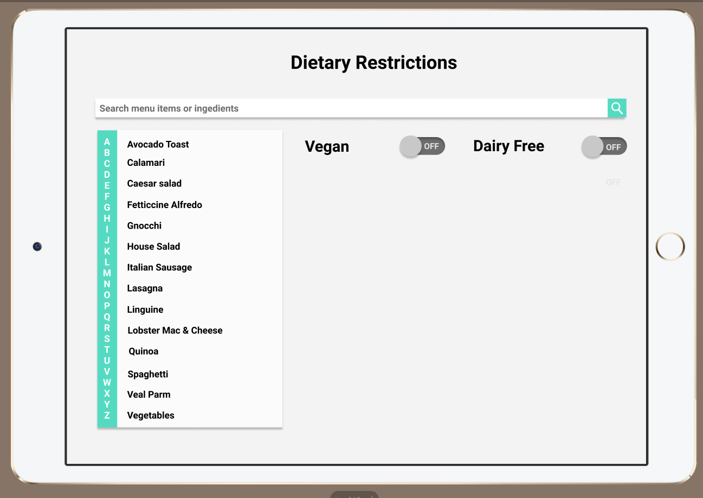
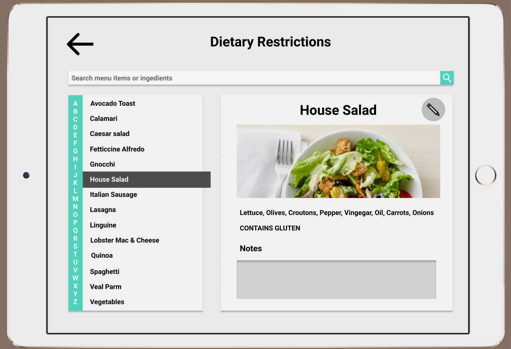
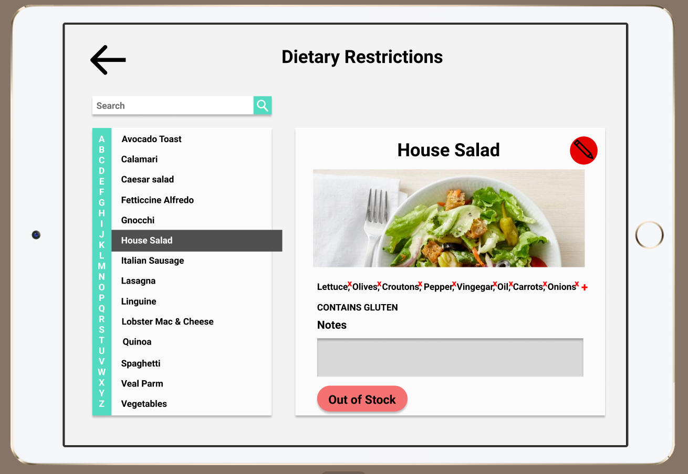
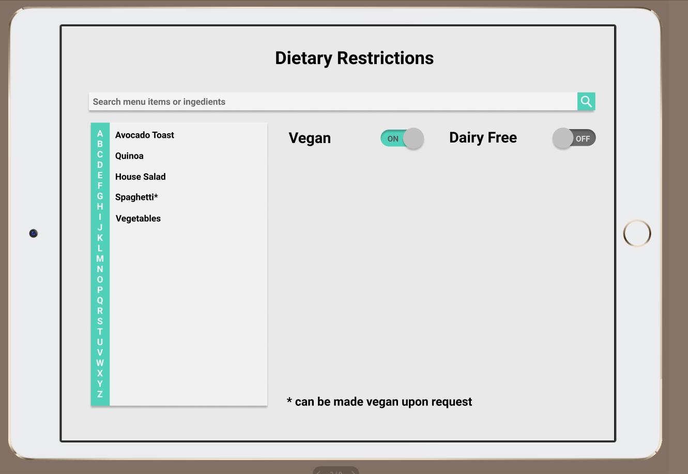
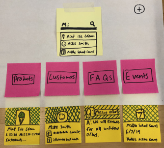
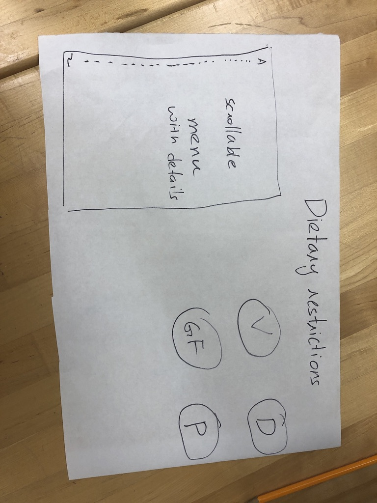

## UXD Tappy Toes - Design Refinement
Submitted: 11/12/19

### Current Design

Our design right now is an app designed for servers and hostesses at restaurants to help them navigate dietary restrictions better. The app is designed to be used on a keyboard-less tablet and help answer customer questions about various items and their ingredients. The interface is designed to be simple, with toggle switches for common dietary restrictions which can be chosen by the restaurant and the ability to inspect any item’s ingredients by clicking on it. 

Clicking on an item like the house salad leads to a page where the ingredients of that item along with the dietary restrictions it doesn’t comply with are marked. This allows servers and hostesses to easily answer questions on what makes up a certain dish. 

The edit button on this page allows restaurants to be modify the page if and when they choose to change their menu/ modify and item. It allows them to delete/add any ingredients and/or notes. They can also mark it as out of stock so that they can be aware of its status when talking to guests. 

Our design also allows for the indication of customizability of items indicating how certain ingredients can swapped out in some items to make them compliant to certain dietary restrictions.

### Paper Prototype

Our current designed evolved from the searching platform we presented in the Design Refinement phase.

We took this design and thought critically about what persona we wanted to design for. We chose to evolve our design to better suit Busy Brian because our initial platform design was too broad as we wanted it to serve various functions for different personas. Below is the second iteration of the paper prototype, narrowed to reflect that the product sold is food and the information that is shared is ingredient/allergen information.

In the paper prototype, we were unsure of what platform our design would be on. We looked further into the types of devices that users similar to Busy Brian had at their disposal. We learned that many restaurants had tablets, such as the Toast POS system that could be a useful device for our platform as well. This table would be great for displaying lots of information, but one trade off that we discovered is that its difficult to use the on screen keyboard. From this insight, we pivoted away from just a search bar for navigation and instead provided an alphabetical list or items, as well as a search bar for navigation. 

### Design Decisions Rationale

Another design decision we made was for the use case where people have multiple dietary restrictions. From this we change the dietary restriction buttons on the right into toggle switches so that the user can select multiple dietary restrictions. With the toggle switched we needed to decide what made sense visually as an on or off state. For instance, if someone could not have food with dairy, would that mean the dairy switch was on or off? We decided to change the text to say “Dairy Free”, instead of just “Dairy”, to eliminate this confusion. 

Furthermore, after presenting our first iteration of the food item display page, it was brought to our attention that modifications could be made to an order to make something fit a dietary restriction. We implemented this design decision by placing an asterisk next to the names of foods that could be modified and added a note at the bottom with how it could be modified. We also added a notes section to each item page so that the restaurant could specify how the dish could be changed. 

### Project Refinement

We continued to evolve our prototype to make it a simpler platform. We ran into the issue of “wanting to do it all” while designing, but during our team discussions, we stopped to think about what we wanted the main functionality to be. Business managers such as Brian are too busy to learn an entire new system, and will not want to use if it’s too complicated. We settled on focusing the ingredients/allergen information in the food that they sell.

The other reason for scoping down our project is that it was too much for the team to take on with its current bandwidth. A more concrete and simpler project actually allowed us to think more creatively about the way that we want the presentation to look as we have a better idea of what features we actually want to implement.

When we did decide on doing the dietary restriction services, we then talked to 5-6 restaurants to understand how they currently dealt with this issue. The responses ranged from using 3 ring binders to “we know it in our heads”. All the processes we learnt about were either too slow and laborious or seemed to contain a high amount of uncertainty/risk. This process helped us because we were able to understand there we needs like explaining customizability and ease of editing that we were not previously aware of. We then modified our prototype to include those features.

### Design Insight

One of the major insights we got from the restaurant owners and people we talked to is that it was crucial that we have this system integrate into the existing infrastructure and way of management at the restaurant. Designing as engineers optimizing for speed/efficiency would probably have led us to make a product which might not be very well received by our target user group. So, we designed a system that best fit our user’s needs. 

### Remaining Questions

The questions we still have regarding the prototype are the following:

* If there is a longer list of menu items, does the alphabetical list of menu items make the most sense for navigation?
* Could this system be maintained by a restaurant staff or is the activation energy to add new items too much work?
* Are these the most frequently asked about allergens?
* Do customers trust this system to correctly display allergen information?
* What other features might be needed?

[Return Home](../Home.md)