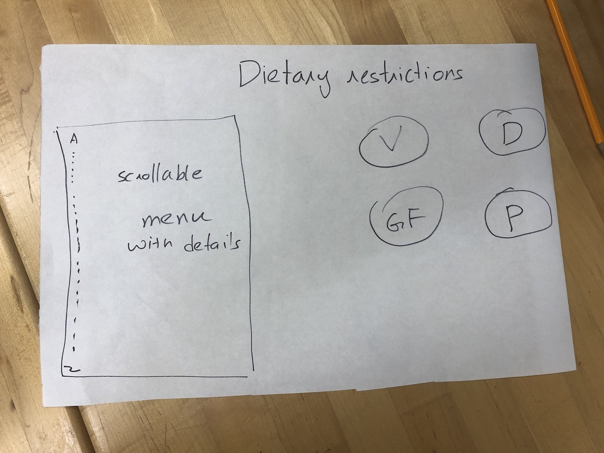

## UXD Tappy Toes - Design Refinement
Submitted: 11/12/19

### Current Design

Our design right now is an app designed for servers and hostesses at restaurants to help them navigate dietary restrictions better. The app is designed to be used on a keyboard-less tablet and help answer customer questions about various items and their ingredients. The interface is designed to be simple, with toggle switches for common dietary restrictions which can be chosen by the restaurant and the ability to inspect any item’s ingredients by clicking on it. 

<!---->

Clicking on an item like the house salad leads to a page where the ingredients of that item along with the dietary restrictions it doesn’t comply with are marked. This allows servers and hostesses to easily answer questions on what makes up a certain dish. 

The edit button on this page allows restaurants to be modify the page if and when they choose to change their menu/ modify and item. It allows them to delete/add any ingredients and/or notes. They can also mark it as out of stock so that they can be aware of its status when talking to guests. 

Our design also allows for the indication of customizability of items indicating how certain ingredients can swapped out in some items to make them compliant to certain dietary restrictions.

### Paper Prototype

Our current designed evolved from the searching platform we presented in the Design Refinement phase.

We took this design and thought critically about what persona we wanted to design for. We chose to evolve our design to better suit Busy Brian because our initial platform design was too broad as we wanted it to serve various functions for different personas. Below is the second iteration of the paper prototype, narrowed to reflect that the product sold is food and the information that is shared is ingredient/allergen information.

In the paper prototype, we were unsure of what platform our design would be on. We looked further into the types of devices that users similar to Busy Brian had at their disposal. We learned that many restaurants had tablets, such as the Toast POS system that could be a useful device for our platform as well. This table would be great for displaying lots of information, but one trade off that we discovered is that its difficult to use the on screen keyboard. From this insight, we pivoted away from just a search bar for navigation and instead provided an alphabetical list or items, as well as a search bar for navigation. 

### Design Decisions Rationale

Another design decision we made was for the use case where people have multiple dietary restrictions. From this we change the dietary restriction buttons on the right into toggle switches so that the user can select multiple dietary restrictions. With the toggle switched we needed to decide what made sense visually as an on or off state. For instance, if someone could not have food with dairy, would that mean the dairy switch was on or off? We decided to change the text to say “Dairy Free”, instead of just “Dairy”, to eliminate this confusion. 

Furthermore, after presenting our first iteration of the food item display page, it was brought to our attention that modifications could be made to an order to make something fit a dietary restriction. We implemented this design decision by placing an asterisk next to the names of foods that could be modified and added a note at the bottom with how it could be modified. We also added a notes section to each item page so that the restaurant could specify how the dish could be changed. 

### Project Refinement

We continued to evolve our prototype to make it a simpler platform. We ran into the issue of “wanting to do it all” while designing, but during our team discussions, we stopped to think about what we wanted the main functionality to be. Business managers such as Brian are too busy to learn an entire new system, and will not want to use if it’s too complicated. We settled on focusing the ingredients/allergen information in the food that they sell.

The other reason for scoping down our project is that it was too much for the team to take on with its current bandwidth. A more concrete and simpler project actually allowed us to think more creatively about the way that we want the presentation to look as we have a better idea of what features we actually want to implement.

When we did decide on doing the dietary restriction services, we then talked to 5-6 restaurants to understand how they currently dealt with this issue. The responses ranged from using 3 ring binders to “we know it in our heads”. All the processes we learnt about were either too slow and laborious or seemed to contain a high amount of uncertainty/risk. This process helped us because we were able to understand there we needs like explaining customizability and ease of editing that we were not previously aware of. We then modified our prototype to include those features.

### Design Insight

One of the major insights we got from the restaurant owners and people we talked to is that it was crucial that we have this system integrate into the existing infrastructure and way of management at the restaurant. Designing as engineers optimizing for speed/efficiency would probably have led us to make a product which might not be very well received by our target user group. So, we designed a system that best fit our user’s needs. 

### Remaining Questions

The questions we still have regarding the prototype are the following:

* If there is a longer list of menu items, does the alphabetical list of menu items make the most sense for navigation?
* Could this system be maintained by a restaurant staff or is the activation energy to add new items too much work?
* Are these the most frequently asked about allergens?
* Do customers trust this system to correctly display allergen information?
* What other features might be needed?

### Heuristic Evaluation from Odditos Team

Overall Impression:
The application has the strengths of simplicity and organization. The layout of the page is very nice and seems as though it is optimized for handheld use. I also like the choices of light color tones, it makes for an appealing interface while also amplifying the tasks within the application. Going forward we suggest interviewing waiters to see what their opinion is on the platform and its services. The quickness of everything they have to doat the table is crucial. The less they have to move around to find the information they need the better.

Heuristic Evaluation:
1. [Visibility of system status] (Severity 3) - 2 of us
After changing the ingredients of a dish, the ingredients list won’t be updated if we leave the page and come back again.
2. [Visibility of System Status] (Severity 4) - 1 of us
The starting page confused me of its location within the app. There is no home page or starting scene which can confuse the user on their location within the platform. There also are no back buttons or any navigation keys
3. [Visibility of System Status] (Severity 4) - 1 of us
There is no home bar or directory tools to know that the search screen is the home screen or where you actually are throughout the application. A home bar or some type of navigation guidance or reference for the user would help a lot. Especially when more features are added to the application.
4. [Visibility of system status] (Severity 2) - 1 of us
When ingredients are removed from a dish, which ingredients were removed should be displayed. This could be done by having them greyed out or some other visual indicator.
5. [Match Between System and the Real World] (Severity 2) - 1 of us
I am confused by the overarching purpose of the “Vegan” and “Dairy Free” filtering-switch — would it make more sense to just simply mark such dishes on the menu for customers, so that customer with “Vegan” and “Dairy free” restrictions don’t need to ask the waiter but can just get this information by looking at the menu.
6. [User Control and Freedom] (Severity 4) - 2 of us
The note section is under-developed and confusing for first time user: is this for waiters to put in a note-for-self or to be sent to the kitchen for specific instructions? Where is the submit button? and how would the waiter know whether particular requirement from the customer is feasible on the kitchen’s end (without running back and forth between the kitchen and table).
7. [User Control & Freedom] (Severity 3) - 3 of us
Right now with just the two options of “Vegan” or “Gluten Free” the system is not overwhelmed and doesn’t have a need for a “clear” or “reset” function. Though, as soon as there are more options the user will need a quick reset feature to provide them with the freedom and an “emergency exit” to get back to the starting position.
8. [User control and freedom] (Severity 4) - 1 of us
There’s no way to order anything from the interface. For an app targeted at restaurant servers, the lack of an ordering function feels wrong. The team should consider adding a shopping cart feature and an order button to complete the user flow of the application.
9. [Consistency and standards] (Severity 3) - 2 of us
When Vegan and Dairy Free are both selected on the main page, the notice for “*can be made Dairy Free upon Request” disappeared. This should be added for consistency with other pages. And the resulting menu items are all vegan items but not the intersection of vegan and dairy free items.
10.[Consistency and Standards] (Severity 3) - 2 of us 
The note section in the “Spagheb” page seems to be playing a different purpose. I would argue that the “*” may be the best efficiency approach for waiter to capture info as they are oden placing order with 7me-constraints. As waiters would receive training on the system and dishes beforehand, I would recommend that the designers to use icon instead of plain words for standard warning and notifications.
11.[Consistency and Standards] (Severity 3) - 1 of us
The “Out of Stock” label only appears in the edit-mode and seems to come out of nowhere. If the designers intended to mean that this dish is out of stock, then the label should appear in the dish page (or make the dish “un- selectable” in the listing; if the designers intended to mean that particular ingredient is out of stock, then they can simply make such ingredient un- selectable.
12. [Error prevention] (Severity 2) - 1 of us
It seems very easy to misclick on ingredients you don’t want to delete. Should probably make the cross button bigger and consider adding a confirmation page.
13. [Recognition rather than recall] (Severity 2) - 1 of us
After the user has selected a dish, the Vegan and Dairy Free option bars should still be present so that users can see which filter they applied.
14.[Flexibility & Efficiency of Use] (Severity 3) - 1 of us
Within the “sold out” pages there should be a notification on the menu task bar on the left side of the screen so you know what is sold out without having to click on it. This will accelerate the use of the application for users and make it more effective.
15. [H6 Recognition Rather Than Recall] (Severity 3) - 1 of us
It would be good to put initials such as “GF” or “V” by the line items in the table on the left. This would prevent users from having to use memory to recall whether or not an item they just looked up is in fact gluten free or vegan. It would allow for fast recognition of the required items for more efficient use of the application.
16.[Help Users Recognize, Diagnose, and Recover from Errors] (Severity 4) - 1 of us
In the dish page, the ingredients are listed is a rather disorganized manner, and the “X” for removal is preXy small and close to each other, potentially leading to errors in order placement. I recommend that: 1) ingredients should be beXer sorted based on their type; the ingredient could be color-coded or listed in different rows to reflect such categorization; 2) Enlarge the remove button to prevent error and increase efficiency of use; 3) If the waiter accidentally removed an ingredient, the ingredient should not just disappear upon removal but listed in a section below for retrieve (if needed).

| Severity | level Number of Instances |
| -------- | ------------------------- |
| 1 | 0 |
| 2 | 4 |
| 3 | 7 |
| 4 | 5 |

### Heuristic Evaluation Take Aways

We learned from our heuristic evaluation that we need to include more affordances that signal  navigation throughout our app. We need to include more features like back arrows, home buttons and a clear all feature for the different filters. This will help the user move through the app with speed.

We also need to make our interface use similar features of menus like icons that represent if menu items are gluten free or vegan, instead of only having the filters. This provides a quicker way to know if something fits a dietary restriction without needing to click anything. Additionally, having a visual for when menu items have sold out would help with quicker information retrieval. In the end, we need to focus on not just quickness of navigation, but more presentation of information, to minimize any need to navigate.

Lastly, we also need to improve the editing capabilities of the platform. This includes creating a format to add ingredients as well as a more aesthetic way to remove ingredients. We should also include a confirmation checkbox after saving a menu item edit, to confirm if they want to make the changes that they have made. 

### Effort Chart for Design Development Phase Submission

| Name |  Role          |
|--------|---------------|
|  Raquel  | Typing up Design Refinement   Refined Computerized Design   Contacting Users   |
|  Sabrina | Typing up Design Refinement   Contacting Users   Refined Computerized Design |
| Sreekanth | Typing up Design Refinement   Initial Computerized Design   Contacting Users   Scenarios   |
| Will | Typing up Design Refinement   Setting Up Website   Contacting Users |

[Return Home](../README.md)
