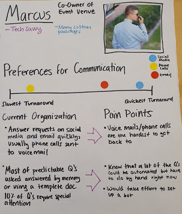

## Needs Analysis Phase

#### What is the problem in brief? What problems are you proposing to solve?

We aim to build a mobile user interface that assists employees of small businesses that participate in heavy community engagement over various communication channels including social media.

The core problem is scarcity of resources, in particular time. We propose to solve this by trying to reduce the time and overhead of the user thinking about and drafting their responses to their customers, and the time it takes to switch between different communication platforms. In the design of this app, we would attempt to streamline the user experience by focusing on allocating screen space to pertinent information to the business owner.

Figure 1: Flow of communication diagram for small businesses through different media.

The design illustration above shows a composite visual of the flow of external communications businesses have to handle. Although each business we interviewed had different methods of communication, they all had different functions for each that were handled in different ways. They commonly experienced some missed opportunities depending on which method of communication a customer chose, if it was one where the turnaround was low.

The design representation below showcases which methods of communication have the most usage/highest customer turnaround in relation to the proximity to a computer.

Figure 2: Initial user interviewees plotted on a 2 by 2 axis where the x-axis is how far they work from their computer and the y-axis is how much they do or do not prefer email over phone usage.
Because the methods of communication vary so widely, we will need to gather more information from other stakeholders to better understand which ones are best consolidated/streamlined in one unit.
#### Who matters?
We aim to not only improve the primary stakeholder’s experience, the external communications/social media managers for small businesses, but also the customer’s experience (a secondary stakeholder). 

#### How will your project change the status quo? 
Small businesses that interact digitally with customers can become overwhelmed by the volume of communication that they handle over different platforms. Companies may miss important messages or waste time responding to the constant stream of communication. Many potential customers ask similar questions in their messages, and so the business owners may end up answering the same thing multiple times for each person, which could waste time and energy.
#### What is (at least) one naïve design idea (rough sketch)?
We propose a solution to allow all the messages to reach the same place from different initial messaging platforms, rank them by predicted importance learnt from patterns and help reply faster and seamlessly through premade templates and chatbots.
Something we had not previously thought of before interacting with potential users is how prominent phone use is for many businesses. We will need to learn from more potential users/make design decisions as to how prominently we will integrate voice calls/messages into this platform. 
#### How do your prospective users think about this problem/activity?
Below is a conceptual model we have constructed for how some small business communications managers view their customers. In some cases where there will be a long term relationship with a customer (for custom orders, for example), the business will have a specific manager continue with that customer for consistency. That customer may contact the business through different platforms. 

Figure 3: A diagram of the delegation of customer handling to managers and the various methods of communication that those managers would need to keep track of.

#### What requirements must your solution satisfy?
From what we learned from our customers, we have constructed people portraits that include some pain points for their current systems operations.

  
Figure 4: Our People portraits for our interviewees
Our service should make less accessible communications easier to use, as this is what resulted in missed opportunities. It should also make it easy to reply to frequently asked questions without having to manually search for the answers.
#### What will the impact of a successful solution be?
A successful solution would allow for lower numbers of missed communications with potential customers, that could result in higher profits. It would also mean less time wasted and less stress/annoyance tin answering simple questions that always have the same answer manually.

#### Effort Chart for Needs Analysis Submission

| Raquel | Business/customer communication conceptual model |
| Sabrina | People portraits, consolidation and explanation of design representations |
| Sreekanth | Flow of communication model |
| Will | Representation of phone/email usage to computer proximity |

