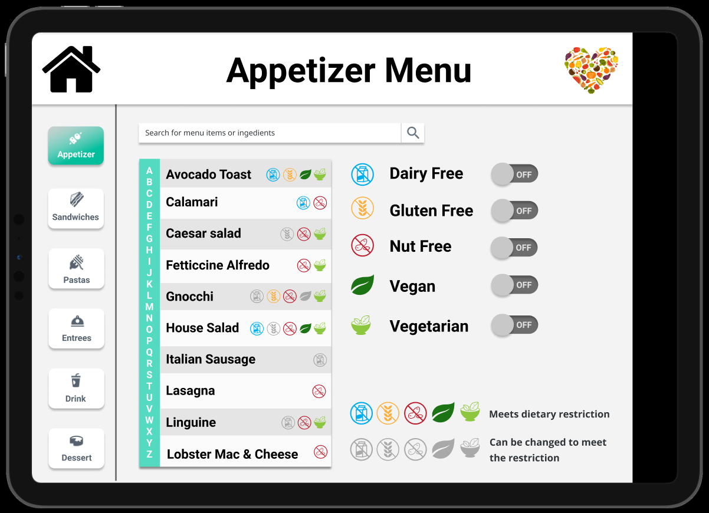
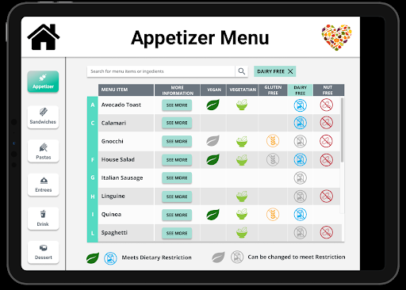

## Formal Usability Study Plan

In this study, we would like to test two different layout designs of our platform to learn which layout is more understandable and efficient for the user.

#### Hypothesis: 

The table layout will be more time-efficient than the switches layout and the users will be able to answer questions about food allergens faster. 

To test this hypothesis, we will conduct a usability test with 2-3 different people who have worked in a front-of-house restaurant. In this test, we will introduce 5-6 different scenarios where the user needs to find information and then we will measure how the participant responds. 

#### Independent Variables:

We will be changing the visual format of each menu item. One of our layouts will have the menu items in card format and have switches that filter the data. The other layout will have a table that presents all of the information and not have the option to filter the data with switches.

#### Quantitative Metrics (Dependent Variables):

##### Access time. 

This can be measured in terms of either the number of clicks required to access the required information or the amount of time the user spends on operations. We would like to measure which approach has the more optimized time.

##### Misclicks. 

We would like to measure the deviation in the user’s click flow from the “optimal” flow to reach a certain screen. This metric would be useful in measuring how clear/confusing our interface design is. An accurate hypothesis would have fewer misclicks. 

##### Type of gestures/clicks.

We would measure what kind of gestures people use and if they are what we think are the optimal ones. This metric would help us understand if the required gestures are obvious through our designs.

#### Questions for A/B testing:

Do you think the tables layout has way too much information?

Does the scrolling mechanism take too much time to find certain items?

Is filtering or a table view more intuitive for searching for information?

Which method of search seems more powerful?

## Results of Formal Usability Study

#### Overview
We tested two versions of information presentation for our system: A table layout version, and a list layout version.  To determine which design direction we should go we consulted with two users.  These users both liked the system but saw places for improvement.  Both preferred the table format, however felt that the filtering functionality needed clearer affordances.

#### Response Variables (formal usability study):

###### Access time
Both testers responded to questions about information retrieval faster using the tabular design.  They liked the aligned columns of icons and larger format and disliked the lack of those things in the list design. (Figure 1)

 
Figure 1: A Side by Side comparison of the tabular format (left) and the list format (right)
###### Misclicks
Both testers misclicked / were uncertain when trying to utilize the filtering system in the tabular design.  One user resorted to trying to search with the search bar.  The system was unclear.  On the flipside, the list design made filtering very clear. (Figure 2)

 
Figure 2: Comparison of the Tabular Design before (left) and after (right) filtering is used.  On the right, the clicked section header indicates we are filtering to Dairy-Free options.
###### Type of gestures/clicks
Both testers said they would avoid typing.  They also didn’t expect any gestures outside of clicking but this is likely affected by the format they were interacting with:  An iPad emulated on a computer through a web browser.
#### Specific Feedback (informal usability study):
- Confused about how to interact with the system at first.  Thought they had to click on items in order to answer the asked questions.  After about 5 seconds understood that the questions could be answered from the main page.
- Didn’t understand what the greyed out icons were supposed to be.  After about 15 seconds understood what it meant to be greyed out.  After about 30 seconds saw the text that described what it meant to be greyed out.
- Dairy free -> Tried to search for it first
	- Then tried the section header.
	- Suggested potentially highlighting some of the tabs already to imply that all of them can be toggled (not sure how I feel about this, but at any rate we require more visibility for the clickability of the table headers).
- Thought we should have a soup and salad section.
- Liked the menu section separation in the app.  Said it would make it faster to navigate without searching.
- Make the design less flat and more intuitive for hectic restaurant environments. This means making the buttons look like buttons and less like a cool tech app. Also make the words much bigger and the side tabs more functional. 

#### Interpretation of Response Variable Results

Both testers were able to find information in the table design fairly quickly when compared to the list format.  One mentioned that the consistent horizontal location of the icons allowed for easy searching and learning of where to find the important information.  They also mentioned that more spacing and bigger size for the icons allowed for better access.  This implies that the table layout will allow people in hectic situations find information easily, and those new to the system still be able to use it effectively.

Both testers were confused by the sorting by category system in the table design.  This is due to a lack of affordances to show that those headers are clickable.  In fact, one of the testers assumed that the search bar was the only way to do this.  This implies that in a real world situation users may utilize the application without ever finding this very important feature.

#### Going Forward
Going forward we are going to work with the table format.  We plan to utilize the feedback we’ve gotten to further improve the application.  We will make the section headers appear more clickable, potentially just make them buttons.  This way the table format will become more usable.  We also plan to make the text and icons bigger so as to make the system easily usable even in high stress environments.  With these changes users should have a much more pleasant time understanding the system, and a much more efficient time extracting information from the system.

